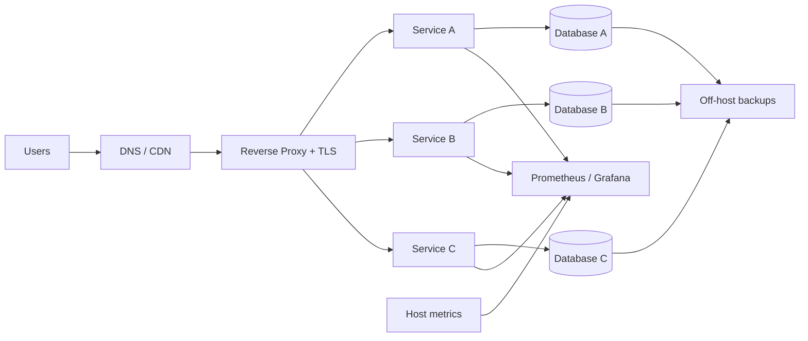

# Multi-tenant SaaS Platform

## Problem

Several customer-facing web/API services needed to share a compact production footprint without making deployment, TLS, data isolation, backups or rollback depend on manual operator memory.

## Constraints

- limited infrastructure footprint
- multiple application processes and domains
- mixed relational data stores
- independent release cadence
- public HTTPS exposure, private administrative access
- recovery needed to remain possible without rebuilding the host

## Architecture

## Controls

- process/service isolation rather than one shared runtime process
- database/user separation by application
- reverse proxy as the public ingress boundary
- automated TLS lifecycle
- repository-scoped deployment credentials
- repeatable deployment plus rollback path
- host, process, database and reachability monitoring
- off-host database backups

## Failure modes considered

| Failure | Detection | Recovery direction |
| --- | --- | --- |
| bad application release | health check / logs / error-rate increase | roll back to known-good release |
| database connection exhaustion | connection and process metrics | reduce pool pressure / restore capacity |
| TLS/ingress error | external reachability check | revert proxy/config change |
| host loss | infrastructure monitoring | rebuild + restore data/config from controlled sources |
| backup silently failing | backup job status / restore exercise | repair pipeline and re-establish recoverable copy |

## Operational lesson

The largest improvement was not any individual tool. It was treating **deployment, rollback, monitoring and backup as one operational system**. A deployment pipeline without rollback or observability only automates the happy path.
