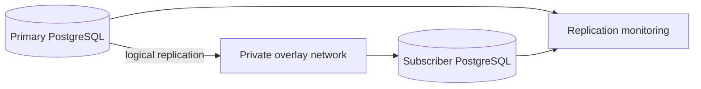

# Cross-site PostgreSQL Replication

## Problem

Selected PostgreSQL data needed to move between sites without exposing the database service directly to the public Internet.

## Architecture

## Design choices

- private overlay connectivity between sites
- logical replication for selected data sets
- explicit replication role instead of broad database credentials
- restricted host-based authentication
- subscription/slot/WAL health monitoring
- documented failback before cutover

## Failure modes

- replication slot growth after subscriber failure
- WAL retention pressure
- schema drift between publisher/subscriber
- network reachability without replication health
- partial data convergence after application writes resume

## Lesson

A green VPN tunnel is not proof that data is safe. **Connectivity, replication health, schema compatibility and failback are separate concerns** and need separate evidence.
