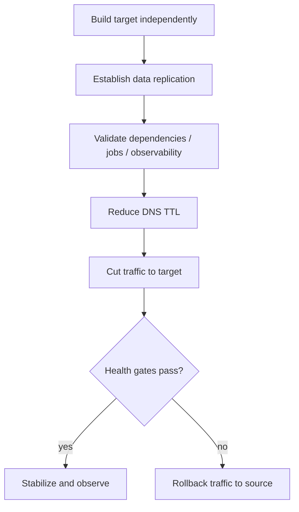

# Cloud Migration with Rollback

## Problem

Move a live workload to a new cloud environment while keeping failure recovery faster than rebuilding the source environment.

## Migration sequence

## Key decision

The source environment remains intact during the rollback window. Rollback is therefore a controlled traffic/application decision rather than an emergency rebuild.

## Validation gates

- data replication current enough for the agreed RPO
- application dependencies reachable
- background/scheduled jobs explicitly accounted for
- monitoring available before traffic cutover
- DNS/cache behavior understood
- source write behavior defined during rollback window

## Lesson

A migration plan is incomplete until it answers: **what exact observation triggers rollback, who can trigger it, and what state will exist after rollback?**
