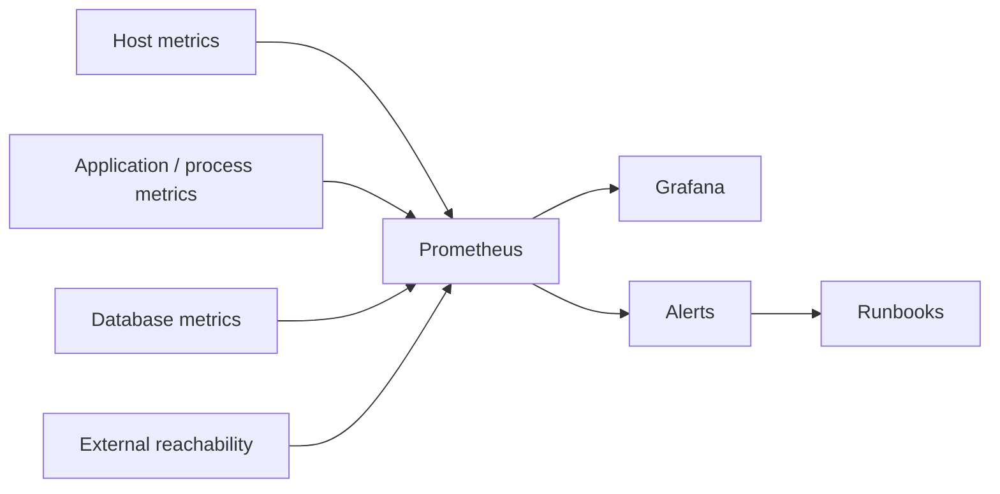

# Observability Baseline for a Small Production Fleet

## Problem

Application availability alone did not explain developing host, process or database pressure soon enough for proactive response.

## Model

## Principles

- dashboards answer exploratory questions
- alerts identify conditions requiring an action
- every important alert maps to an operator response
- database connection pressure is monitored alongside host resources
- external reachability is distinct from internal process health

## Lesson

A dashboard is visualization, not operational monitoring, until **someone knows what action to take when the signal changes**.
