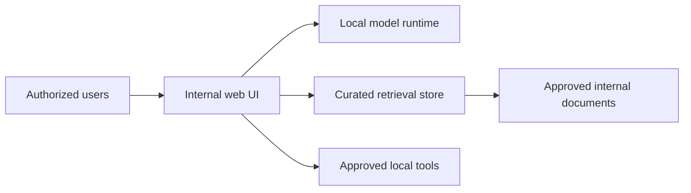

# Local-first Internal AI Platform

## Problem

Provide internal AI assistance while keeping sensitive source material inside infrastructure under organizational control.

## Architecture pattern

## Security boundary

"Local" is not equivalent to "secure." The design considers:

- host administrative access
- model/plugin network egress
- update channels
- prompt/document logging
- browser/tool integrations
- document ingestion permissions
- user/group separation

## Lesson

The useful security question is not "is the model local?" but **which components can read sensitive context and which components can send data outside the trust boundary?**
